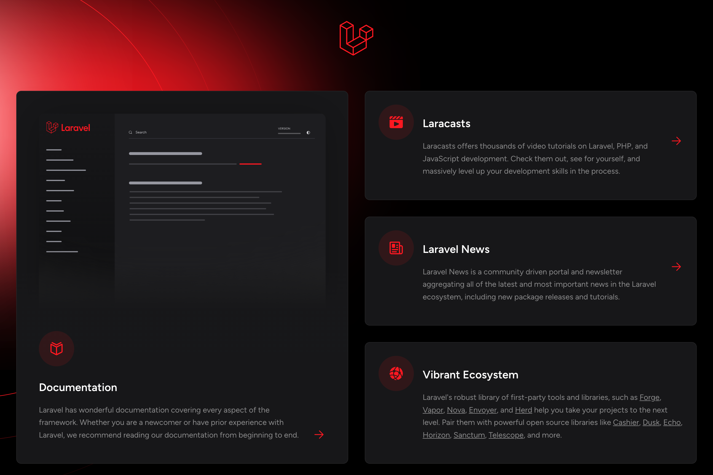
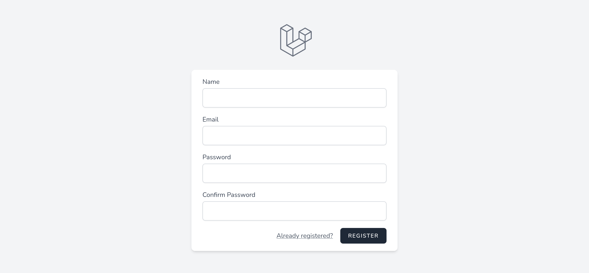
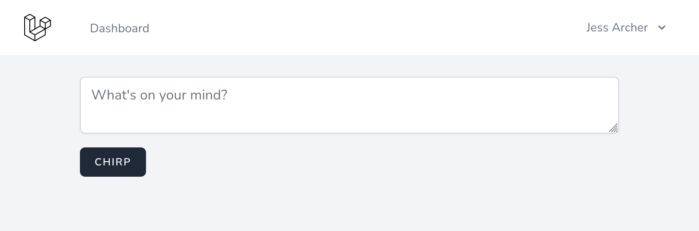

# Laravel Boot camp Chirpers BLADE project application

## Quick  Laravel Installation

If you have already installed `PHP` and `Composer` on your local
machine, you may create a new Laravel project via `Composer`:

```bash
composer create-project laravel/laravel chirper
```

**NOTE:**

- You will need a `supported version of PHP` before continuing.
- You may check your installation by running the `php -v` command.
- Alternatively, you may follow the [instructions for Docker](https://bootcamp.laravel.com/livewire/installation#docker)

For simplicity, Composer's `create-project` command will automatically
create a new `SQLite` database at `database/database.sqlite` to store
your application's data. After the project has been created, start
Laravel's local development server using the Laravel Artisan's `serve`
command:

```bash
cd chirper
php artisan serve
```

Once you have started the Artisan development server, your application will be accessible in your web browser at <http://localhost:8000>.
A fresh Laravel installation



## Installation via Docker

If you do not have PHP installed locally, you may develop your application
using `Laravel Sail`, a light-weight `command-line interface` for interacting
with Laravel's default Docker development environment, which is compatible
with all operating systems.

Before we get started, make sure to install Docker for your operating system.

For alternative installation methods, check out our full installation guide.

The easiest way to install Laravel is using our `laravel.build` service, which
will download and create a fresh Laravel application for you.

Launch a terminal and run the following command:

```bash
curl -s "<https://laravel.build/chirper>" | bash
```

Sail installation may take several minutes while Sail's application
containers are built on your local machine.

By default, the installer will pre-configure Laravel Sail with a number
of useful services for your application, including a MySQL database server
just in case you decide to use MySQL instead of SQLite. You may customize
the Sail services if needed.

After the project has been created, you can navigate to the application
directory and start Laravel Sail:

```bash
cd chirper

./vendor/bin/sail up
```

**NOTE:**

- You can create a shell alias that allows you execute Sail's commands
  more easily.

When developing applications using `Sail`, you may execute `Artisan`, `NPM`,
and `Composer` commands via the Sail CLI instead of invoking them directly:

```bash
./vendor/bin/sail php --version
./vendor/bin/sail artisan --version
./vendor/bin/sail composer --version
./vendor/bin/sail npm --version
```

Once the application's Docker containers have been started, you can access
the application in your web browser at: <http://localhost>.


## Installing Laravel Breeze

Next, we will give your application a head-start by installing
`Laravel Breeze`, a minimal, simple implementation of all of Laravel's
authentication features, including `login`, `registration`, `password reset`,
`email verification`, and `password confirmation`.

Once installed, you are welcome to customize the components to suit your needs.

Laravel Breeze offers several options for your view layer, `including Blade templates`,
`Livewire`, or `Vue` and `React` with `Inertia`.

Open a new terminal in your `chirper project directory` and install your chosen
stack with the given commands:

```bash
# Class

composer require laravel/breeze --dev
php artisan breeze:install livewire-functional
```

```bash
# Functional

composer require laravel/breeze --dev
php artisan breeze:install livewire-functional
```

Now, we just need to start the `Vite` development server to automatically
recompile our CSS and refresh the browser when we make changes to our Blade
templates:

```bash
npm run dev
```

If you refresh your new Laravel application in the browser, you should now
see a `Register` link at the top-right. Follow that to see the registration
form provided by Laravel Breeze.



Register yourself an account and log in!

## Creating Chirps

You're now ready to start building your new application!

Let's allow our users to post short messages called Chirps.

### Models, migrations, and controllers

To allow users to post Chirps, we will need to create `models`, `migrations`,
and `controllers`.

Let's explore each of these concepts a little deeper:

- `Models` provide a powerful and enjoyable interface for you to interact
  with the tables in your database.
  
- `Migrations` allow you to easily create and modify the tables in your
  database. They ensure that the same database structure exists everywhere
  that your application runs.
  
- `Controllers` are responsible for processing requests made to your
  application and returning a response.

Almost every feature you build will involve all of these pieces working
together in harmony, so the `artisan make:model` command can create them all
for you at once.

Let's create a `model`, `migration`, and `controller` for our Chirps with
the following command:

```bash
php artisan make:model -mc Chirp
```

**NOTICE:**

- You can see all the available options by running the
 `php artisan make:model --help` command.

This command will create three files for you:

- `app/Models/Chirp.php` - The Eloquent model.

- `database/migrations/<timestamp>_create_chirps_table.php`:
  the database migration that will create your database table.
  
- `app/Http/Controllers/ChirpController.php`: the HTTP controller
  that will take incoming requests and return responses.

## Routing

We will also need to create `URLs` for our controller.

We can do this by adding `routes`, which are managed in the routes
directory of your project.

Because we're using a resource controller, we can use a single `Route::resource()`
statement to define all of the routes following a conventional URL structure.

To start with, we are going to enable two routes:

- The `index` route will display our form and a listing of Chirps.

- The `store` route will be used for saving new Chirps.

We are also going to place these routes behind two `middleware`:

- The `auth` middleware ensures that only logged-in users can access the route.

- The `verified` middleware will be used if you decide to enable email verification.

```php
# routes/web.php

<?php

use App\Http\Controllers\ChirpController;
use App\Http\Controllers\ProfileController;
use Illuminate\Support\Facades\Route;

Route::get('/', function () {
    return view('welcome');
});

Route::get('/dashboard', function () {
    return view('dashboard');
})->middleware(['auth', 'verified'])->name('dashboard');

Route::middleware('auth')->group(function () {
    Route::get('/profile', [ProfileController::class, 'edit'])->name('profile.edit');
    Route::patch('/profile', [ProfileController::class, 'update'])->name('profile.update');
    Route::delete('/profile', [ProfileController::class, 'destroy'])->name('profile.destroy');
});

Route::resource('chirps', ChirpController::class)
    ->only(['index', 'store'])
    ->middleware(['auth', 'verified']);

require __DIR__.'/auth.php';
```

This will create the following routes:

| Verb |   URI   | Action |  Route Name  |
|:----:|:-------:|:------:|:------------:|
| GET  | /chirps | index  | chirps.index |
| POST | /chirps | store  | chirps.store |

**NOTICE:**

- You may view all of the routes for your application by running the
  `php artisan route:list` command.

Let's test our route and controller by returning a test message from the `index`
method of our new `ChirpController` class:

```php
# app/Http/Controllers/ChirpController.php

<?php
...
use Illuminate\Http\Response;

class ChirpController extends Controller
{
    /**
     * Display a listing of the resource.
     */

   # public function index()
    public function index(): Response
    {
       return response('Hello, World!');
    }
    
    ...
}
```

If you are still logged in from earlier, you should see your message
when navigating to <http://localhost:8000/chirps>, or
<http://localhost/chirps> if you're using Sail!

## Blade

Not impressed yet? Let's update the `index` method of our `ChirpController`
class to render a Blade view:

```php
#app/Http/Controllers/ChirpController.php

<?php
...
use Illuminate\View\View;

class ChirpController extends Controller

{
    /**
     * Display a listing of the resource.
     */

    # public function index(): Response
    public function index(): View

    {
        # return response('Hello, World!');
        return view('chirps.index');
    }
 ...

}
```

We can then create our Blade view template with a form for creating
new Chirps:

```php
# resources/views/chirps/index.blade.php

<x-app-layout>
    <div class="max-w-2xl mx-auto p-4 sm:p-6 lg:p-8">
        <form method="POST" action="{{ route('chirps.store') }}">
            @csrf
            <textarea
                name="message"
                placeholder="{{ __('What\'s on your mind?') }}"
                class="block w-full border-gray-300 focus:border-indigo-300 focus:ring focus:ring-indigo-200 focus:ring-opacity-50 rounded-md shadow-sm"
            >{{ old('message') }}</textarea>
            <x-input-error :messages="$errors->get('message')" class="mt-2" />
            <x-primary-button class="mt-4">{{ __('Chirp') }}</x-primary-button>
        </form>
    </div>
</x-app-layout>
```

That's it!

Refresh the page in your browser to see your new form rendered in the
default layout provided by Breeze!



If your screenshot doesn't look quite like the above, you may need to
stop and start the Vite development server for Tailwind to detect the
CSS classes in the new file we just created.

From this point forward, any changes we make to our Blade templates will
be automatically refreshed in the browser whenever the Vite development
server is running via npm run dev.

## Navigation menu

Let's take a moment to add a link to the navigation menu provided by
Breeze.

Update the `navigation.blade.php` component provided by Breeze to add a
menu item for desktop screens:

```php
# resources/views/layouts/navigation.blade.php

<div class="hidden space-x-8 sm:-my-px sm:ml-10 sm:flex">
    <x-nav-link :href="route('dashboard')" :active="request()->routeIs('dashboard')">
        {{ __('Dashboard') }}
    </x-nav-link>
    <x-nav-link :href="route('chirps.index')" :active="request()->routeIs('chirps.index')">
        {{ __('Chirps') }}
    </x-nav-link>
</div>
```

And also for mobile screens:

```php
# resources/views/layouts/navigation.blade.php

<div class="pt-2 pb-3 space-y-1">
    <x-responsive-nav-link :href="route('dashboard')" :active="request()->routeIs('dashboard')">
        {{ __('Dashboard') }}
    </x-responsive-nav-link>
    <x-responsive-nav-link :href="route('chirps.index')" :active="request()->routeIs('chirps.index')">
        {{ __('Chirps') }}
    </x-responsive-nav-link>
</div>
```

## Saving the Chirp

Our form has been configured to post messages to the `chirps.store` route
that we created earlier.

Let's update the `store` method on our `ChirpController` class to validate
the data and create a new Chirp:

```php
# app/Http/Controllers/ChirpController.php

<?php
...
use Illuminate\Http\RedirectResponse;
use Illuminate\Http\Request;
use Illuminate\Http\Response;
use Illuminate\View\View;

class ChirpController extends Controller
{
 ...
    /**
     * Store a newly created resource in storage.
     */

    public function store(Request $request)

    public function store(Request $request): RedirectResponse
    {
        $validated = $request->validate([
            'message' => 'required|string|max:255',
        ]);

        $request->user()->chirps()->create($validated);

        return redirect(route('chirps.index'));
    }
 ...
}
```

We're using Laravel's powerful validation feature to ensure that the
user provides a message and that it won't exceed the 255 character
limit of the database column we'll be creating.

We're then creating a record that will belong to the logged in user
by leveraging a `chirps relationship`. We will define that relationship
soon.

Finally, we can return a redirect response to send users back to the
`chirps.index` route.

## Creating a relationship

You may have noticed in the previous step that we called a `chirps`
method on the `$request->user()` object. We need to create this method
on our `User` model to define a `has many` relationship:

```php
# app/Models/User.php

<?php
namespace App\Models;
// use Illuminate\Contracts\Auth\MustVerifyEmail;
use Illuminate\Database\Eloquent\Relations\HasMany;
use Illuminate\Foundation\Auth\User as Authenticatable;
use Illuminate\Notifications\Notifiable;
use Laravel\Sanctum\HasApiTokens;

class User extends Authenticatable
{
 ...
    public function chirps(): HasMany
    {
        return $this->hasMany(Chirp::class);
    }
}
```

**NOTICE:**

- Laravel offers many different types of model relationships that you
  can read more about in the [Eloquent Relationships documentation](https://laravel.com/docs/eloquent-relationships).

## Mass assignment protection

Passing all of the data from a request to your model can be
risky.

Imagine you have a page where users can edit their profiles.
If you were to pass the entire request to the model, then a user
could edit any column they like, such as an `is_admin` column.
This is called a `mass assignment vulnerability`(<https://en.wikipedia.org/wiki/Mass_assignment_vulnerability>).

Laravel protects you from accidentally doing this by blocking mass
assignment by default. Mass assignment is very convenient though,
as it prevents you from having to assign each attribute one-by-one.

We can enable mass assignment for safe attributes by marking them as
`fillable`.

Let's add the `$fillable` property to our `Chirp` model to enable
mass-assignment for the `message` attribute:

```php
# app/Models/Chirp.php

<?php
 ...

class Chirp extends Model
{
 ...
    protected $fillable = [
        'message',
    ];
}
```

You can learn more about Laravel's mass assignment protection in the
documentation.

## Updating the migration

During the creation of the application, Laravel already applied the default migrations that are included in the database/migrations directory. You may inspect the current database structure by using the php artisan db:show and php artisan db:table commands:

php artisan db:show
php artisan db:table users

So, the only thing missing is extra columns in our database to store the relationship between a Chirp and its User and the message itself. Remember the database migration we created earlier? It's time to open that file to add some extra columns:
database/migrations/<timestamp>_create_chirps_table.php

```php
<?php

 ...

return new class extends Migration

{

    /**

     * Run the migrations.

     */

    public function up(): void

    {

        Schema::create('chirps', function (Blueprint $table) {

            $table->id();

            $table->foreignId('user_id')->constrained()->cascadeOnDelete();

            $table->string('message');

            $table->timestamps();

        });

    }

 ...

};
```

We haven't migrated the database since we added this migration, so let's do it now:

php artisan migrate

Each database migration will only be run once. To make additional changes to a table, you will need to create another migration. During development, you may wish to update an undeployed migration and rebuild your database from scratch using the php artisan migrate:fresh command.

## Testing it out

We're now ready to send a Chirp using the form we just created! We won't be able to see the result yet because we haven't displayed existing Chirps on the page.
Chirp form

If you leave the message field empty, or enter more than 255 characters, then you'll see the validation in action.

## Artisan Tinker

This is great time to learn about Artisan Tinker, a REPL (Read-eval-print loop) where you can execute arbitrary PHP code in your Laravel application.

In your console, start a new tinker session:

php artisan tinker

Next, execute the following code to display the Chirps in your database:

App\Models\Chirp::all();

=> Illuminate\Database\Eloquent\Collection {#4512
     all: [
       App\Models\Chirp {#4514
         id: 1,
         user_id: 1,
         message: "I'm building Chirper with Laravel!",
         created_at: "2022-08-24 13:37:00",
         updated_at: "2022-08-24 13:37:00",
       },
     ],
   }

You may exit Tinker by using the exit command, or by pressing Ctrl + c.
